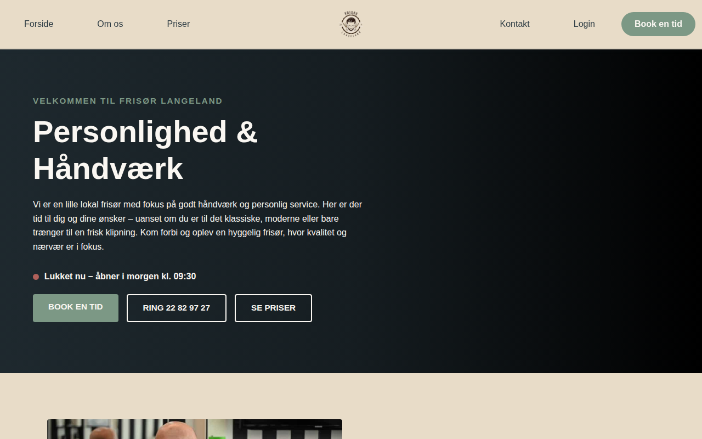
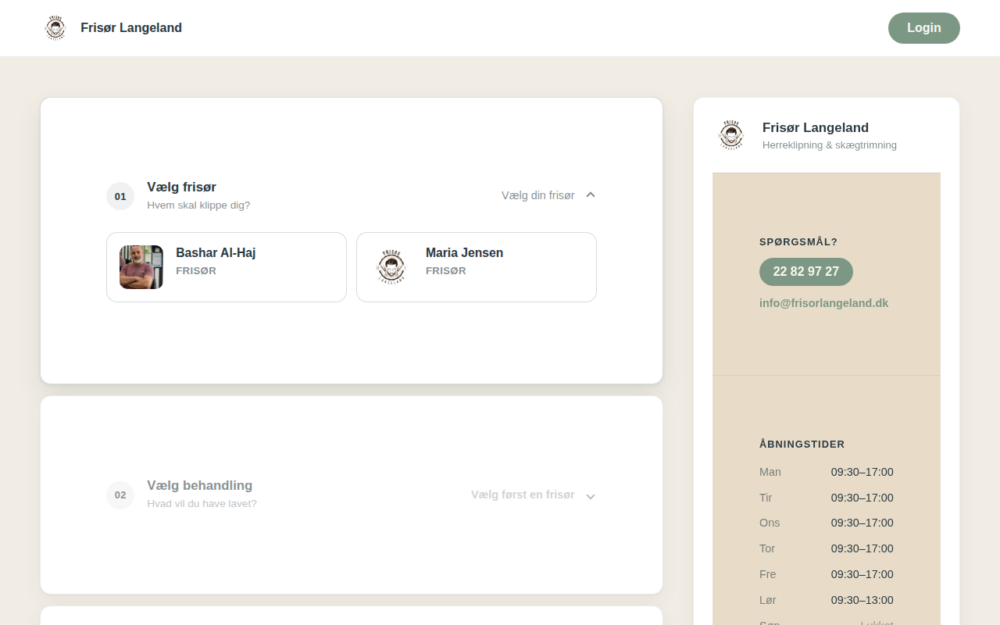
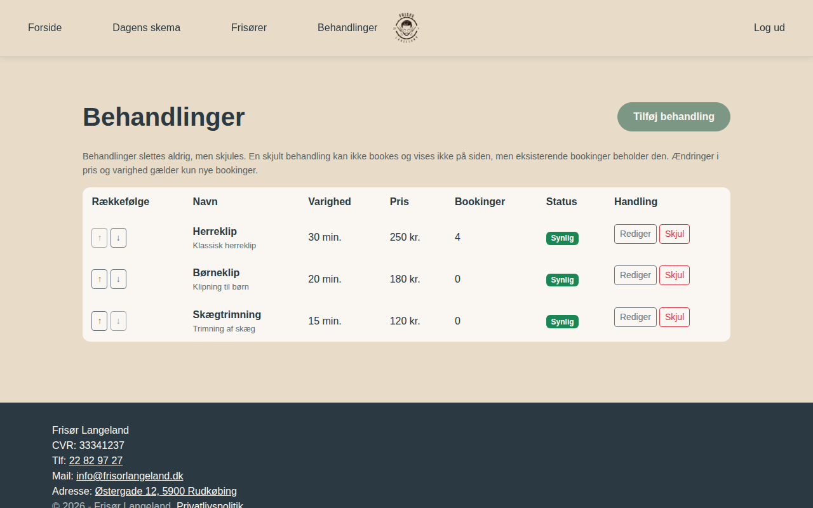

# Frisør Langeland

Website and online booking for a barber shop in Rudkøbing, Denmark. Live at <https://www.frisorlangeland.dk>.



## What it does

- Public pages: front page with an open/closed indicator, prices, about, privacy policy
- Four-step booking wizard: treatment, barber, date and time, contact details
- Customers are identified by email. New customers confirm their email through a link; unconfirmed accounts and their bookings are removed after 24 hours
- "My bookings" page for customers
- Admin: day and month schedule, edit/cancel/no-show bookings, manage barbers and treatments (hide instead of delete, sort order, price stored per booking)
- No double bookings: a booking is only created when its time range doesn't overlap an active one

| Booking | Admin: treatments |
| --- | --- |
|  |  |

## Built with

.NET 10, ASP.NET Core MVC with Razor views, ASP.NET Core Identity, EF Core (SQL Server), MailKit, libphonenumber, Bootstrap. Hosted on Azure App Service.

## Running it locally

You need the [.NET 10 SDK](https://dotnet.microsoft.com/download) and a SQL Server instance. The default connection string in `BarberLangeland/appsettings.json` uses SQL Server Express (`.\SQLEXPRESS`, database `FrisorDb`). Migrations are applied on startup.

```
dotnet run --project BarberLangeland/BarberLangeland.csproj --launch-profile http
```

The site is served at <http://localhost:5039>.

### Admin account

The admin email is `Salon:AdminEmail` in `appsettings.json`. Set the password as a user secret, never in a file that is committed:

```
dotnet user-secrets set "Salon:AdminPassword" "<password>" --project BarberLangeland/BarberLangeland.csproj
```

### Email

Without `Email:Smtp:Host` nothing is sent and accounts are created already confirmed. To enable verification, set `Email__Smtp__Host`, `Email__Smtp__Port`, `Email__Smtp__UserName`, `Email__Smtp__Password`, `Email__Smtp__FromAddress` and `Site__BaseUrl` (for example as Azure app settings).

### Migrations

```
dotnet ef migrations add <Name> --project BarberLangeland/BarberLangeland.csproj
```

## Tests

```
dotnet test BarberLangeland.Tests
```

The tests run the real application in-process against an in-memory SQLite database, so no SQL Server is needed.

## Project layout

| Path | Contents |
| --- | --- |
| `BarberLangeland/Controllers` | Public pages, booking, account, admin, barbers, treatments |
| `BarberLangeland/Services` | Booking, availability, customer identity, email |
| `BarberLangeland/Data` | `ApplicationDbContext` and migrations |
| `BarberLangeland/Views`, `wwwroot` | Razor views, CSS, JS, images |
| `BarberLangeland.Tests` | xUnit tests |

## Deployment

Every push to `main` builds, runs the tests and deploys to Azure through `.github/workflows/main_frisorlangeland.yml`.
